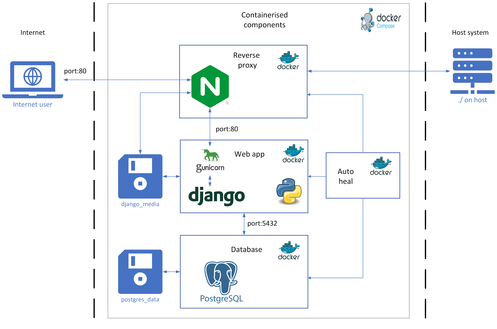

# Architecture

## Development

The development version of the web app uses just two docker containers in an isolated docker network:

- [Django](https://www.djangoproject.com/): Python application that handles the web content.
- [Postgres](https://www.postgresql.org/): A SQL database that holds all of the website and candidate data.

All of the candidate images and other files from the observations are stored a separate docker volume of "django_media", and the postgres database files are stored in the "postgres_data" volume. The docker network structure for the development version is the following:

## Production

The production version is very similar to development, however the Django application is run using [Gunicorn](https://gunicorn.org/) instead to assist with handling a number of requests at once. Two more containers are added in this configuration:

- [Nginx](https://nginx.org/en/): Assists with load balancing of requests to the Django container and helps protect against various security threats from the greater internet.
- [Autoheal](https://github.com/willfarrell/docker-autoheal): A container that watches every other container and will restart them if it sees that they are in a damaged or some form of error state.

The docker network structure for production is as follows:

