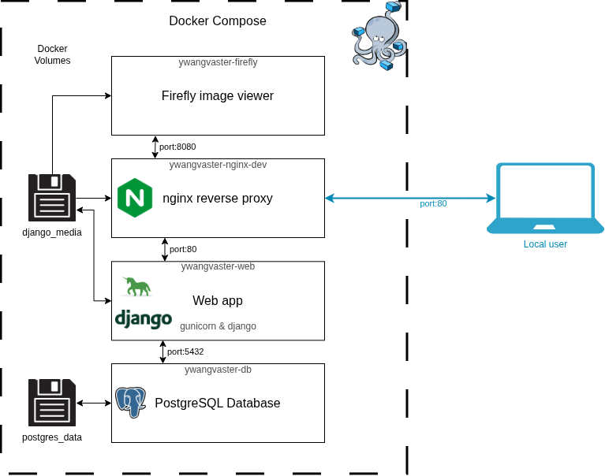
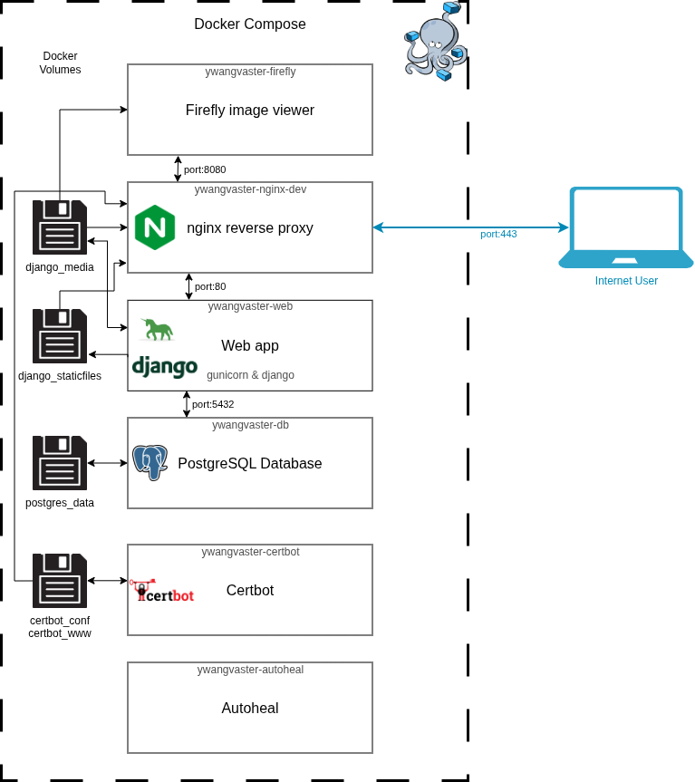

# Architecture

## Development

The development version of the web app uses three docker containers in an isolated docker network:

- [Django](https://www.djangoproject.com/): Python application that handles the web content.
- [Postgres](https://www.postgresql.org/): A SQL database that holds all of the website and candidate data.
- [Firefly](https://github.com/Caltech-IPAC/firefly): An interactive FITS viewer embedded in the candidate rating page.

All of the candidate images and other files from the observations are stored a separate docker volume of "django_media", and the postgres database files are stored in the "postgres_data" volume. The docker network structure for the development version is the following:

## Production

The production version is very similar to development, however the Django application is run using [Gunicorn](https://gunicorn.org/) instead to assist with handling a number of requests at once. Three more containers are added in this configuration:

- [Nginx](https://nginx.org/en/): Terminates HTTPS (port 443) using Let's Encrypt certificates, redirects HTTP to HTTPS (port 80), proxies requests to Django and Firefly, and serves static/media files directly.
- [Certbot](https://certbot.eff.org/): Automatically renews the Let's Encrypt TLS certificate every 12 hours.
- [Autoheal](https://github.com/willfarrell/docker-autoheal): A container that watches every other container and will restart them if it sees that they are in a damaged or some form of error state.

The docker network structure for production is as follows:

## Staging

The staging environment is identical to production in its container structure. It displays a `[STAGING]` indicator in the header bar. A `staging-details.html` file can optionally be placed in the repo root to display release notes on the staging home page.

## Docker Compose file structure

The Docker Compose configuration is split across multiple files that are layered together by the `Makefile`:

| File                         | Purpose                                                            |
| ---------------------------- | ------------------------------------------------------------------ |
| `docker-compose.yml`         | Base service definitions shared across all environments            |
| `docker-compose.dev.yml`     | Development-specific overrides (port mapping, debug settings)      |
| `docker-compose.prod.yml`    | Production-specific additions (Nginx, Certbot, Autoheal, Gunicorn) |
| `docker-compose.staging.yml` | Staging-specific overrides (layered on top of prod)                |
| `docker-compose.volumes.yml` | Local volume path configuration                                    |

## Makefile

All environment management is done through the `Makefile`. Available targets:

| Target                                         | Description                                                     |
| ---------------------------------------------- | --------------------------------------------------------------- |
| `make dev`                                     | Start the development environment (Django + Postgres + Firefly) |
| `make dev-down`                                | Stop the development environment                                |
| `make prod`                                    | Start the production environment in detached mode               |
| `make prod-down`                               | Stop the production environment                                 |
| `make staging`                                 | Start the staging environment in detached mode                  |
| `make staging-down`                            | Stop the staging environment                                    |
| `make cert-init-prod EMAIL=you@example.com`    | Obtain a Let's Encrypt certificate for production               |
| `make cert-init-staging EMAIL=you@example.com` | Obtain a Let's Encrypt certificate for staging                  |

All `up` targets pass `--build` so images are rebuilt automatically when code changes.
