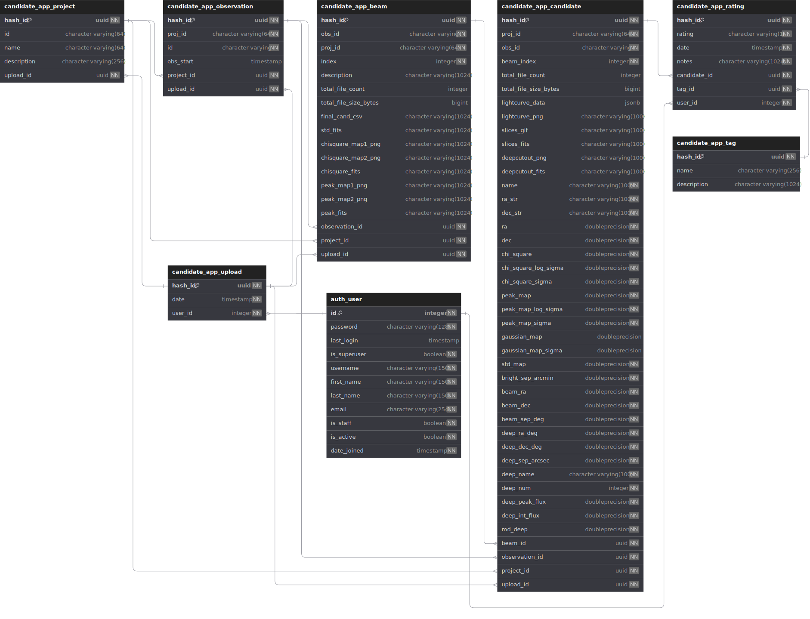

# Database

## Structure

The database for this webapp is a Postgres v16 container with the Q3C extension installed. All indexing of coordinates and initialisation of the database is handled by a combination of entrypoint scripts for the docker containers and Django migration scripts.

When candidate data is uploaded, it is split into separate models: Projects, Observations, Beam, Candidates, with each model being linked back with a foreign key relationship. When attempting to add a new record using the `upload_cand.py` script, it will create the necessary records if they don't already exist. For example, if candidates under a given "project_id" have not been uploaded before, then a new project with that name will be created and the candidates will be listed under that newly created project. The same will happen for the Observations, Beams, and Candidates.

The Beams and Candidates hold the related files for each observation. This includes all of the fits, slices gif, and deep images. The Beam model holds the files for the statistical maps, and the Candidate model only holds files relating to that specific candidate.

A diagram of how the database is structured can be found below.



## Clearing the database

Deleting all content from the database can be done by stopping and starting up the docker containers with the volume flag `-v`. All of the data is stored in docker volumes and not in the containers themselves.

To stop the docker containers and delete the volumes:

```bash
docker compose -f docker-compose.prod.yml down -v
```

and simply start the containers again with

```bash
docker compose -f docker-compose.prod.yml up -d
```

## ATNF Pulsars

The full ANTF pulsar [catalogue](https://www.atnf.csiro.au/research/pulsar/psrcat/) is imported into the webapp on first start-up. This is done to make the searching of the database much quicker rather than making a web request for each search on the candidate rating page page.

The pulsar catalogue is regularly updated automatically at 12am Sunday every week by the Django web container. This is done using a cron job defined in the `containers/web/refresh_pulsar_table_cron` file.

Alternatively, you can force the update manually by using the following docker command on host machine:

```bash
    docker exec -it ywangvaster-web python3 /ywangvaster_webapp/manage.py refresh_pulsar_table
```

This will download and parse the full ATNF database and overwrite the current version of the table in the Postgres container. When running the update command you will see logs printed to the terminal.
