# Usage

## User Management

When logged in, users will see a "User management" button appear in the top right of the navbar.

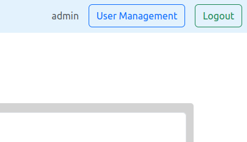

The pop-up allows users to quickly change the global filtering of all projects or a specific individual project, access their upload token for uploading candidates, or to change their password.

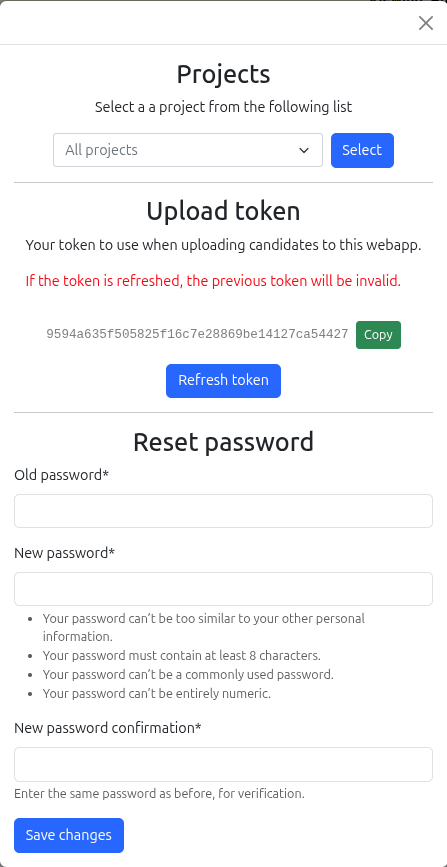

Please note that the filtering by projects is only saved in the user session data and will be forgotten when the user logs out of the web application.

## Candidates

The "Candidates" page is where users can filter (within all or a selected project) by observation, beam, deep number, cone searches (candidate, beam, and/or deep coordinates, all in separation in arcmin), or by any of the various float values that were uploaded with the candidate.

When filtering with the float sliders, they will _only_ show candidates with values between the requested minimums and maximums from sliders. They will exclude candidates that have "nan" or "inf" values for that particular variable. However, the unfiltered defaults will show candidates with all values. Hover over any slider label for a tooltip describing the field.

### Rating status filter

The rating status filter is a three-way selector:

- **All** — show all candidates regardless of rating status
- **Rated** — show only candidates that have been rated
- **Unrated** — show only candidates not yet rated

### Best-beam filter

Checking the "Best beam only" checkbox restricts results to candidates flagged as the best-beam detection for their source. For each group of candidates within 5 arcseconds of each other in the same observation, the one with the lowest beam separation angle is marked as the best beam. This filter is useful for de-duplicating candidates that were detected in multiple beams.

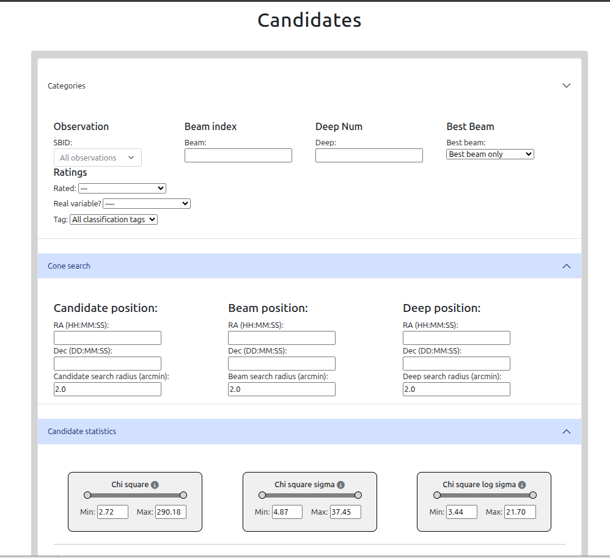

Users can sort the filtered results by the columns of the table by clicking on the column header for that variable/column, in either ascending or descending order.

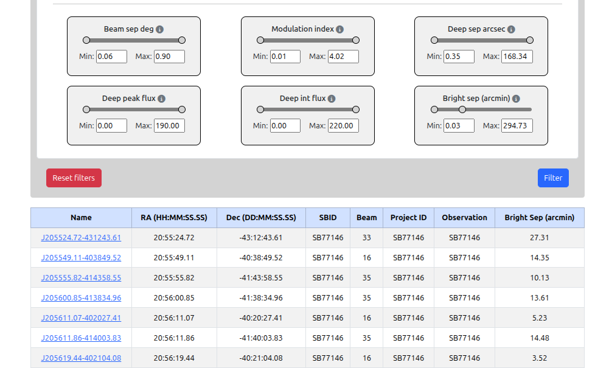

Navigating to a filtered candidate summary page is done by clicking on the "name" of the candidate.

## Candidate Rating

### Summary

When clicking on the name of a candidate from the Candidates page, users will be directed to the page `/candidate_rating/<candidate_hash_id>`. Users will be shown a summary of all candidate data, the deep image and slices gif (if uploaded), a plot in Apache Echarts of the peak lightcurve data, the Aladin Lite plugin (pointed to the candidate coordinates), the Firefly FITS viewer, and the relevant statistical maps of the beam.

If the candidate is not flagged as the best-beam detection for its source, a warning banner is shown at the top of the page.

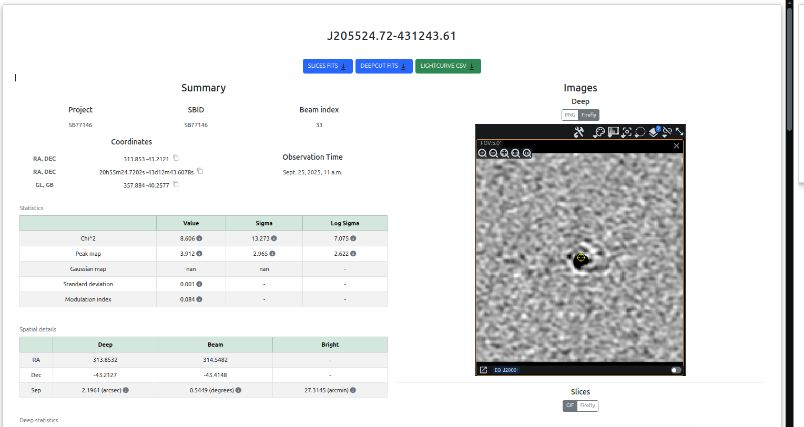

Users will also be able to pause, play and select individual frames using the slider for the slices gif.

All the data is available to download for the candidate and beam from this page, either being the slices fits, deep fits, Lightcurve Peak Flux CSV (with RMS error) and along with the beam STD, Peak, and Chisquared fits files (at the bottom of the page). Download buttons on the page will only be present if there were files uploaded with the candidate data using the upload script.

### Coordinates

A coordinates table is shown on the candidate page displaying the RA and Dec in both decimal degrees and HMS/DMS format. Each coordinate can be copied to the clipboard using the copy button next to it.

### Firefly FITS Viewer

An embedded [Firefly](https://github.com/Caltech-IPAC/firefly) viewer is available on the candidate page for interactive exploration of FITS files (deep and slice images). These files are also available for download to view in external programs.

### Nearby Objects Search

Users are able to search for nearby objects of x (float) arcmin radius about the candidate's coordinates. The webapp queries the following sources:

- **ATNF Pulsar catalogue** — stored locally for fast lookup
- **SIMBAD** — queried via web request
- **Radio catalogues via DataCentral DAS API** — NVSS, VLASS, RACS-low, RACS-mid, GLEAM, and SRSC
- **Local database** — other candidates within the selected project(s), drawn from all observations

Please note that the search will take longer to load when requesting a relatively large arcmin radius. The search radius is capped at 60 arcminutes.

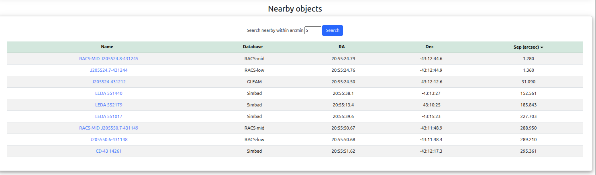

Users are also able to sort these results by ascending or descending order, but are ordered by ascending separation of arc-minutes from the candidate by default.

### Rating

On the right side of the candidate rating page there is a ratings modal that allows users to rate a candidate. As well as indicating whether a candidate is a real variable source the user can select a "Tag" to describe the source and include notes.

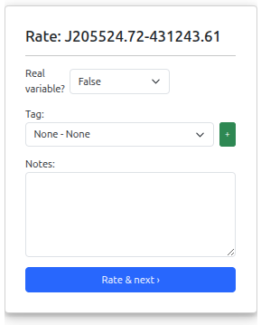

Users can submit multiple ratings with different tags and notes for the same candidate. All previous ratings for the candidate are shown on the page. Clicking "Next unrated candidate" will redirect the user to the next candidate that has no ratings from them within the currently selected project(s) and active filters.

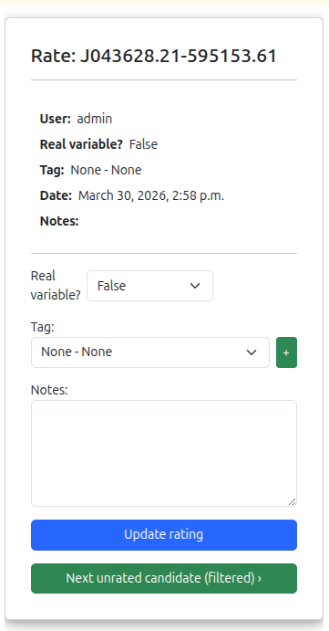

### Creating a Classification Tag

If a suitable classification tag is not present for a particular candidate, users can choose to create a new tag if required by clicking on the green "+" button and the following modal will show:

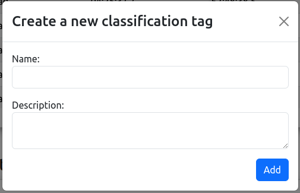

Please note that the web application has a number of tags loaded by default on initial startup. This list can be found in the Django database migration file:

`ywangvaster_webapp/candidate_app/migrations/0005_create_tags.py`

Classification tags are global and can be accessed for all projects and users. At the moment, tags can only be deleted or modified from the Django admin page.

## Ratings Summary

On this page users can see an overview of all the ratings that have been submitted for candidates by all other users. These ratings are also filtered by project like the rest of the web application. Users can further filter this page by tag, confidence and user that performed the rating.

The two Echarts plots are simple bar charts for the counts of 'Ratings per User' and 'Ratings per Classification Tag'. These plots are produced from the filtering form below and will change if the user chooses to filter for observation, tag, confidence, etc.

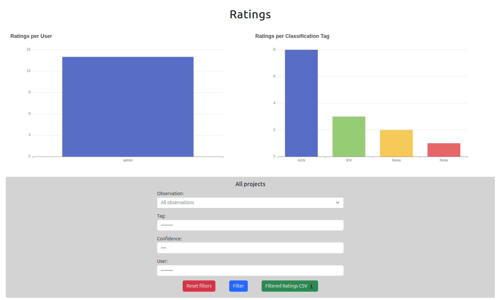

The table shows only the most recent rating per candidate. A "# ratings" column shows the total number of ratings for each candidate.

The filtered ratings (from the form) can be downloaded in CSV form using the "Download filtered ratings" button. This will download a zip file that contains all of the tags and notes for each tag in a `tags.csv`, as well as the filtered ratings data in a `ratings.csv` file.

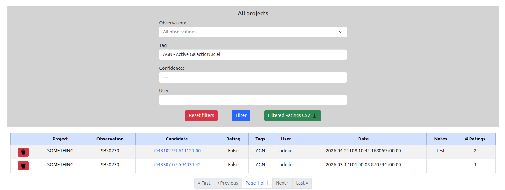

Users that have staff privileges will be able to delete individual rating records, which is done by clicking on the rubbish bin icon on the left most column of the ratings table. This deletion is permanent and there is no way to recover the deleted record.

## Site Admin

Only users that have staff privileges will be able to see this page. They will be presented with a list of projects and a observations that were uploaded for each project. The table details the space used on the host machine of the total in gigabytes.

Each table is for each project that's been created and the observations under each project is listed. Users will be able to see the observation ID (SBID), the user that uploaded the data, the upload date, the number of beams in the observation, the total number of candidates in the observation, the number of candidates that have been rated, the total number of ratings (from all users), the space used and the number files of the observation.

Deleting individual observations can be done by clicking on the rubbish bin icon on the left most column. Similarly, users can delete for the project and all of the observations in the project. Please note that this will delete all relevant data to the project, including ratings. The deletion is permanent and accidentally deleted data cannot be recovered.

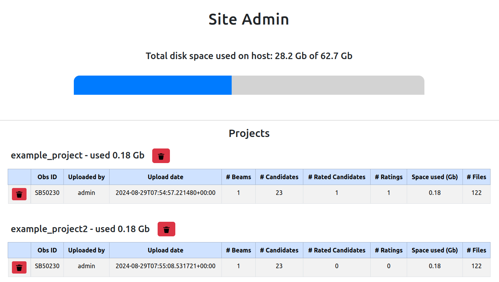
